```{r setup, include=FALSE}
knitr::opts_chunk$set(echo = TRUE)
```

# futurevisions

A small R package with color palettes based on NASA's Visions of the Future poster series.

NASA has produced a series of posters called [Visions of the Future](https://www.jpl.nasa.gov/visions-of-the-future/). They are retro-future-style posters depecting humans visiting other planets, moons, and exo-planets. The main library at the University of Georgia has some of them hanging up on one of the hallways I walk down every day. I thought they might make for a fun series of color palettes. 

# List of Palettes

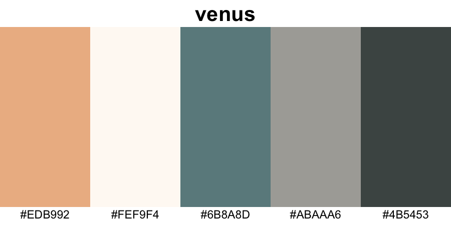

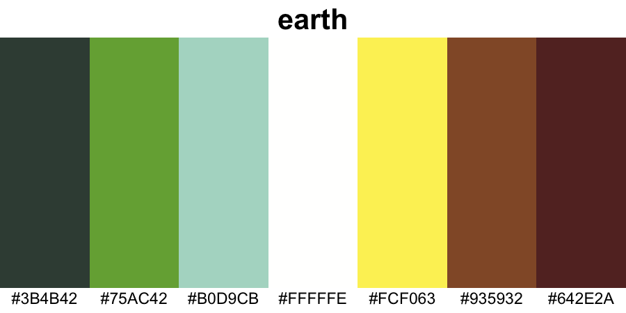

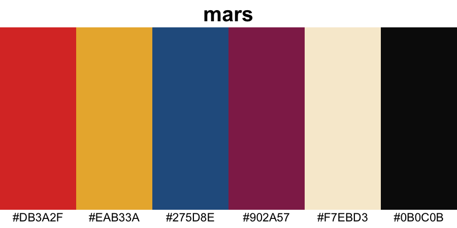

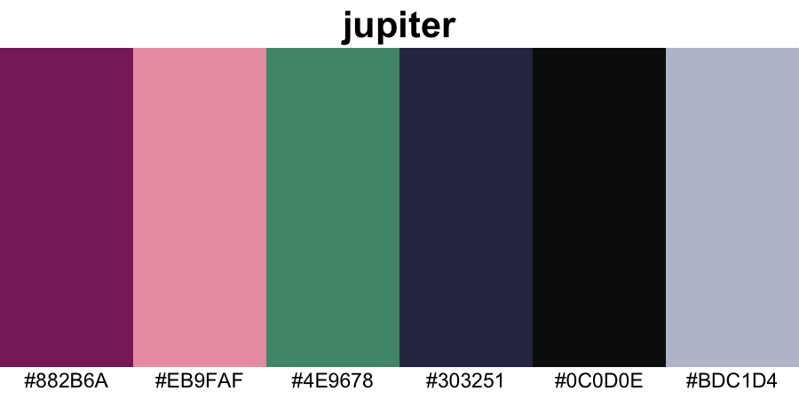


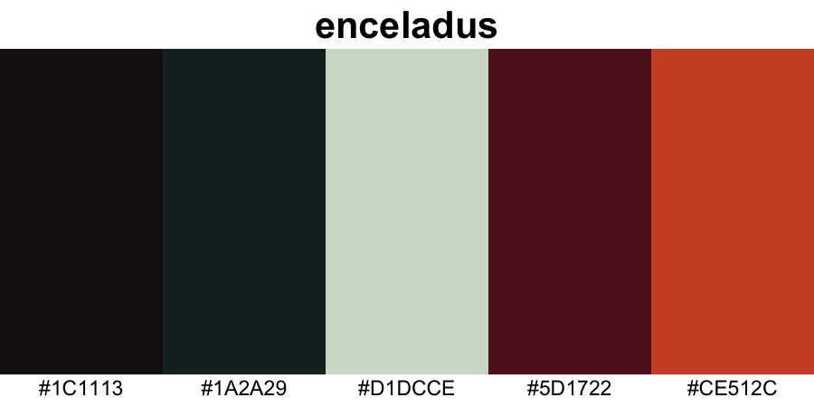

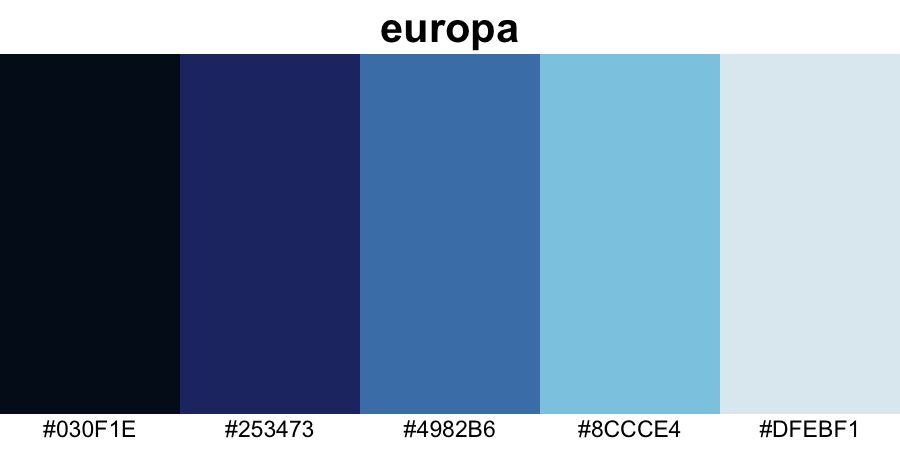


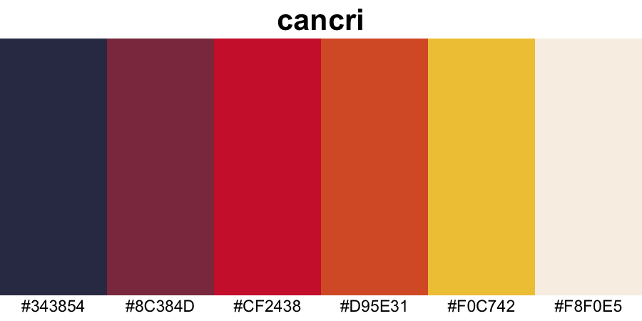

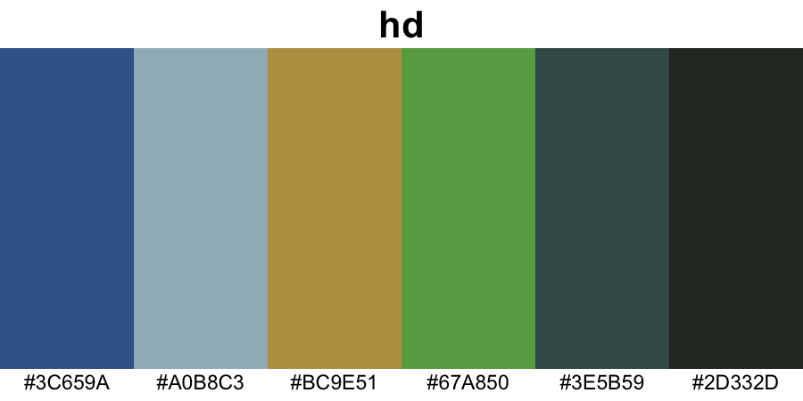

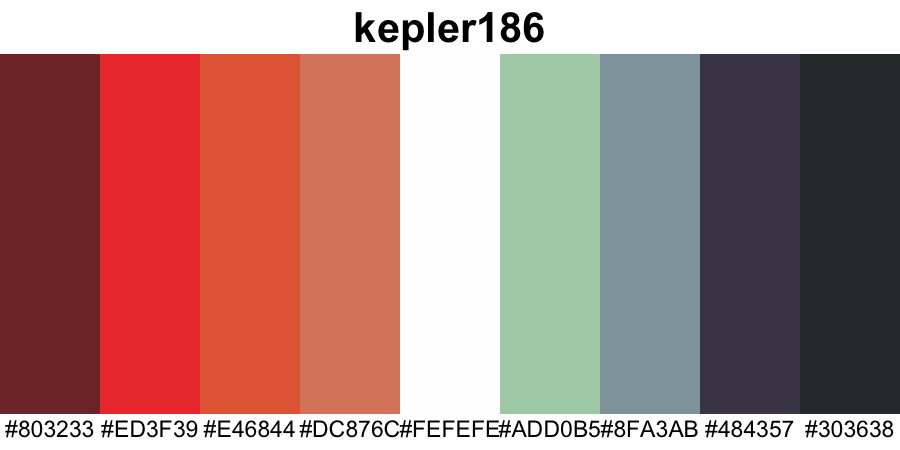

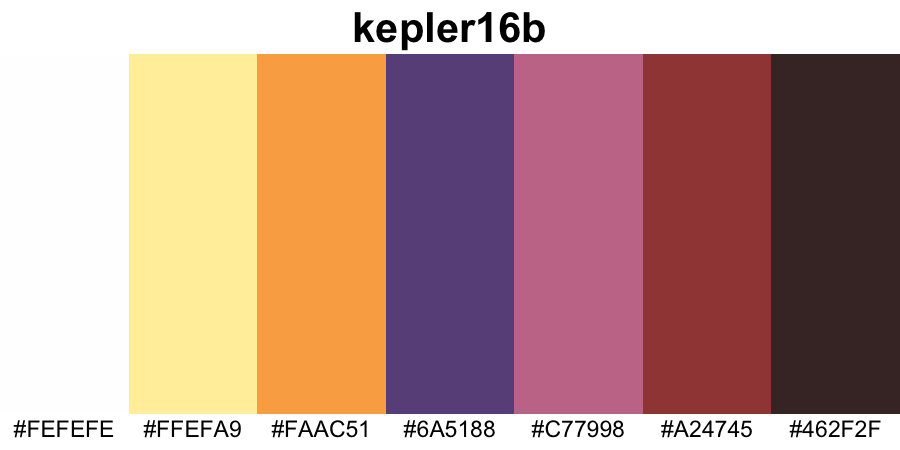

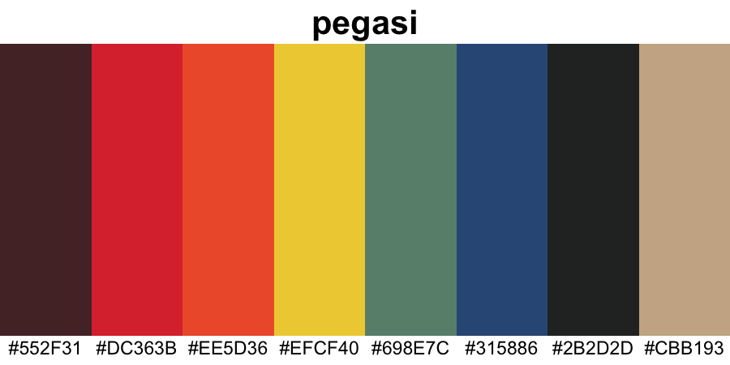

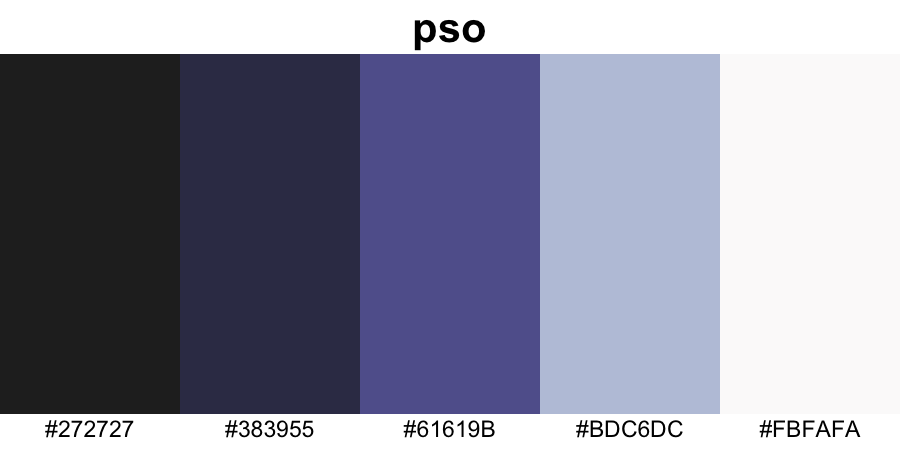

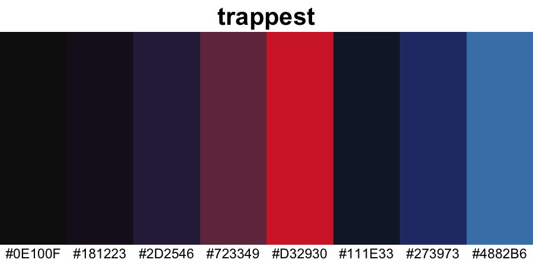

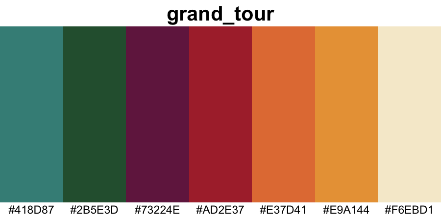

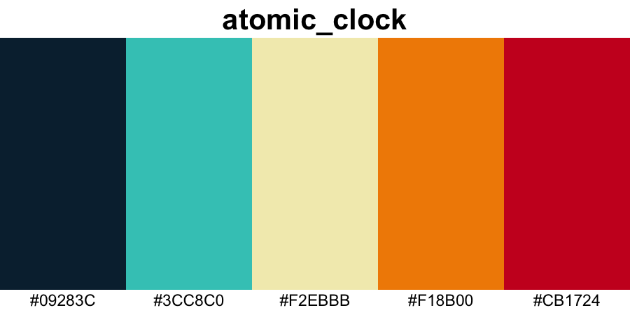


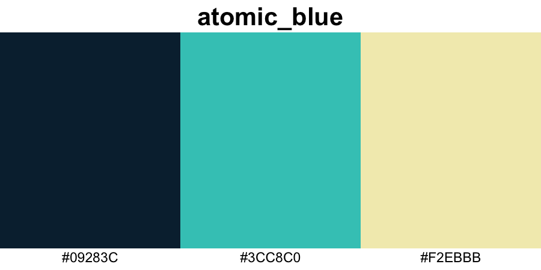

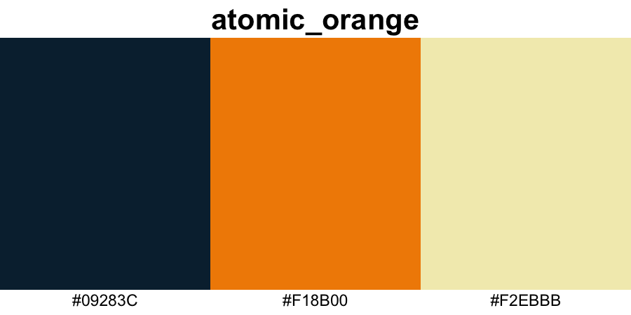
