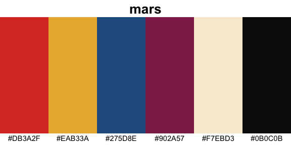
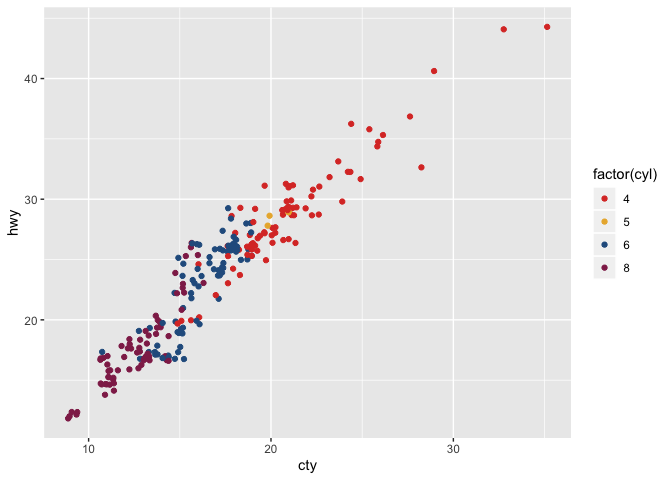
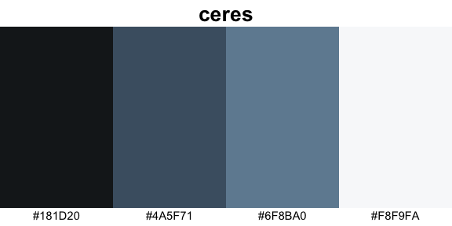
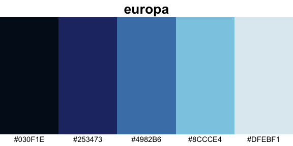
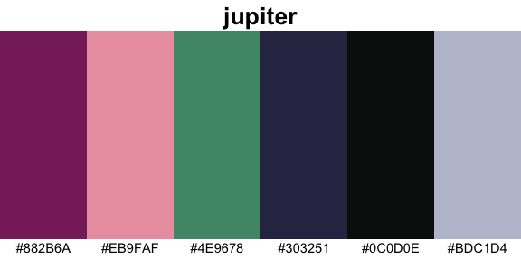
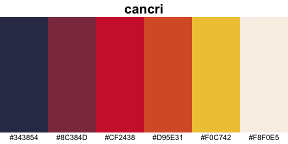
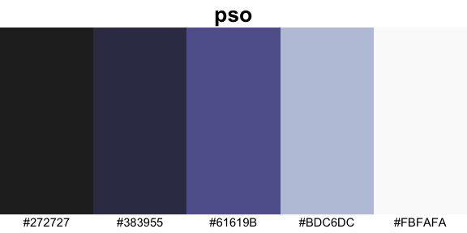
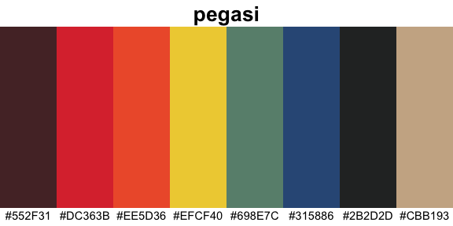

# futurevisions

A small R package with color palettes based on NASA’s [Visions of the
Future](https://www.jpl.nasa.gov/visions-of-the-future/) poster series.

These posters were produced through NASA’s Jet Propulsion Laboratory
through the California Institute of Technology. They are
retro-future-style posters depecting humans visiting other planets,
moons, and exo-planets. In their words,

> Imagination is our window into the future. At NASA/JPL we strive to be
> bold in advancing the edge of possibility so that someday, with the
> help of new generations of innovators and explorers, these visions of
> the future can become a reality. As you look through these images of
> imaginative travel destinations, remember that you can be an architect
> of the future.

The posters are available for download for free. You can get them as
PDFs or as 20x30 inch TIFF files.

## Demo

The main two functions are `futurevisions`, which returns a list of
colors, and `show_palette`, which produces a simple image using
`ggplot2` to highlight the colors. For example, here is the palette
called `mars`.

``` r
show_palette("mars")
```

<!-- -->

``` r
futurevisions("mars")
```

    ## [1] "#DB3A2F" "#EAB33A" "#275D8E" "#902A57" "#F7EBD3" "#0B0C0B"

This can be easily used within `ggplot2` using `scale_color_manual`:

``` r
ggplot(mpg, aes(cty, hwy, color = factor(cyl))) +
  geom_jitter() +
  scale_color_manual(values = futurevisions("mars"))
```

<!-- -->

## Note on color selection

This is not a rigorous samping of colors. I picked a few colors from
each poster that I felt were represtentative. They may not necessarily
be colorblind-friendly. When using these palettes in data visualization,
take care to ensure that your data is not misrepresented.

# List of palettes

## Gradient

These are palettes that may lend themselves better to more gradient
purposes.

``` r
show_palette("ceres")
```

<!-- -->

``` r
show_palette("europa")
```

<!-- -->

``` r
show_palette("titan")
```

<!-- -->

``` r
show_palette("cancri")
```

<!-- -->

``` r
show_palette("pso")
```

<!-- -->

## Diverging

These are palettes that may lend themselves more to highlighting
deviations from a center point.

``` r
show_palette("earth")
```

<!-- -->

``` r
show_palette("enceladus")
```

<!-- -->

``` r
show_palette("kepler186")
```

<!-- -->

``` r
show_palette("trappest")
```

<!-- -->

``` r
show_palette("atomic_clock")
```

<!-- -->

## Categorical

These are palettes that may lend themselves more to purposes where each
color is a stand-alone entity with no meaningful order.

``` r
show_palette("venus")
```

<!-- -->

``` r
show_palette("mars")
```

<!-- -->

``` r
show_palette("jupiter")
```

<!-- -->

``` r
show_palette("hd")
```

<!-- -->

``` r
show_palette("kepler16b")
```

<!-- -->

``` r
show_palette("pegasi")
```

<!-- -->

``` r
show_palette("grand_tour")
```

<!-- -->

``` r
show_palette("atomic_red")
```

<!-- -->

``` r
show_palette("atomic_blue")
```

<!-- -->

``` r
show_palette("atomic_orange")
```

<!-- -->

# Background

A portion of the 3rd floor of the Main Library at the University of
Georgia has been designed to be evocative of the 1950s when the library
was first built. It has some retro-style furniture in a nice study room.
It also has some of these Visions of the Future posters hanging up in
the hallway. I walk down that hallway every day since the linguistics
books, the [DigiLab](https://digi.uga.edu), the best study room on campus, and my personal
carrell are all on that floor.

In fall 2019 I put together [a series of
workshops](http://joeystanley.com/pages/dataviz) on data visualization.
[One of them](http://joeystanley.com/downloads/191023-color.pdf) was
devoted to color, and in preparations for it, I saw that people have
made color palettes based on all sorts of things: [Wes Anderson
movies](https://www.designcontest.com/blog/inspiration-gallery-wes-anderson-color-palettes/),
[Skittles](http://alyssafrazee.com/2014/03/06/RSkittleBrewer.html),
[Pokemon](http://pokepalettes.com), you name it. I had the idea that the
posters on that floor might make for some fun color palettes.

I put off making the palettes themselves until now (February 2020).
